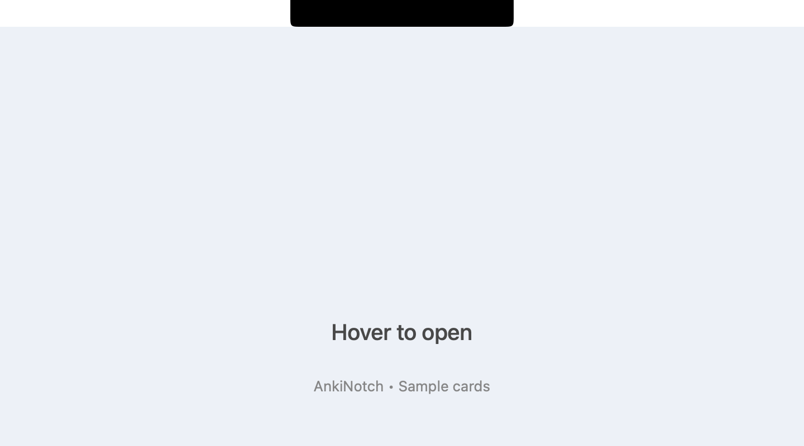

# AnkiNotch

Review Anki cards from your Mac's notch. Hover to open a card, press Space to reveal the answer, and press Space again to mark it Good. Move the pointer away to return to what you were doing.



*Demo uses sample cards and a clean backdrop.*

**Free, open source, and in early beta.** Anki remains the scheduler; AnkiNotch is a separate macOS companion that connects to Anki Desktop through AnkiConnect.

[Download the beta](https://github.com/script-amv/anki-notch/releases/tag/v0.1.0-beta.1) · [Report a problem](https://github.com/script-amv/anki-notch/issues/new)

## Requirements

- macOS 15 Sequoia or later.
- The beta download contains Apple silicon and Intel binaries. Apple silicon has been tested; the Intel build has not been tested on hardware.
- [Anki Desktop](https://apps.ankiweb.net/) running on the same Mac, with [AnkiConnect](https://ankiweb.net/shared/info/2055492159) installed and its default endpoint available at `http://127.0.0.1:8765`.
- A notch is optional: on other displays, hover at the top center of the screen.

## Install and connect

1. In Anki, open **Tools → Add-ons → Get Add-ons…**, enter `2055492159`, and restart Anki. Leave Anki running while you use AnkiNotch.
2. Download `AnkiNotch-v0.1.0-beta.1-universal.zip` from the [release page](https://github.com/script-amv/anki-notch/releases/tag/v0.1.0-beta.1), unzip it, and move **AnkiNotch.app** into **Applications**.
3. Open AnkiNotch. This beta is **ad-hoc signed and not notarized**. If macOS blocks it, try opening it once, then go to **System Settings → Privacy & Security → Open Anyway** and confirm. Follow [Apple's instructions](https://support.apple.com/en-us/102445); you do not need to disable Gatekeeper.
4. Hover over the notch (or the top center of a display without one) until the card panel opens. Keep the pointer over the panel while reviewing.

The app lives in the menu bar and has no Dock icon. Its menu contains **Settings…** and **Quit AnkiNotch**. Open it manually after logging in; automatic launch and automatic updates are not included yet.

## Controls

| Action | Control |
| --- | --- |
| Reveal the answer | Space on the question |
| Grade Good and show the next card | Space on the answer |
| Grade Again and show the next card | `1` on the answer |
| Undo the latest answer made here in the current review session | ⌘Z |
| Choose a deck or return to All decks | Click the notch while the panel is open |
| Close the panel | Move the pointer outside it |

All decks is the default. A deck choice lasts until you quit the app; parent decks include their subdecks. Only Again and Good are available in this beta. Use Anki itself when you need Hard, Easy, editing, burying, or suspending.

Settings include **Bouncy animations** (on by default, respects macOS Reduce Motion) and **Force black background** (off by default). Preferences persist across launches.

## Your collection and privacy

Grading here is a real review in Anki and changes your collection and review history. Anki handles scheduling and sync. AnkiNotch drives Anki's review window, so it can change what that window shows; avoid reviewing in both apps at the same time. Back up your collection before trying an early beta.

AnkiNotch has no account, analytics, or telemetry. Its own Anki requests go to localhost. It renders your cards' HTML, CSS, JavaScript, and local media; externally hosted resources or scripts in a card may still make network requests. Anki, AnkiConnect, and your decks are installed separately and are not included in the download.

## Known limitations

- Audio and text-to-speech are not supported; Anki audio markers are removed from the rendered card.
- Card layouts can differ from Anki's own reviewer. The panel uses a fixed 480-point width and the question's height; a longer answer scrolls.
- Cards start at the very top of the screen, so the physical camera housing can obscure content in the center of the top edge.
- Custom note types and scripts need testing. Forcing black changes the card canvas, but inner elements can retain their own colors.
- A crowded menu bar can hide the Settings/Quit icon. There is no separate settings launcher.
- No Windows, Linux, mobile, configurable AnkiConnect API key, or remote Anki connection support.
- The Intel binary is cross-compiled; hardware testing is still needed.

If the panel says **Open Anki**, start Anki and check that AnkiConnect is installed, then hover again. For **Anki error**, check your AnkiConnect configuration and restart Anki. **All done** means there are no cards to show in the current selection.

When reporting a problem, include your macOS and Anki versions, Mac model/chip, and steps to reproduce. Use sample cards or redact screenshots; do not upload your collection or private card content.

## Build from source

Install Xcode Command Line Tools (`xcode-select --install`) or Xcode with a Swift 6 toolchain, then:

```sh
git clone https://github.com/script-amv/anki-notch.git
cd anki-notch
make build
make test
make app
```

`make app` builds and ad-hoc signs the app, then installs it to `~/Applications/AnkiNotch.app`, replacing any app at that path. It does not quit or restart a running instance. Tests use a mock Anki client and do not require Anki.

To try canned sample cards without touching a collection:

```sh
ANKINOTCH_MOCK=1 make run
```

`make package` assembles a universal release app in `build/AnkiNotch.app` without installing it. See [release instructions](docs/RELEASING.md) and [contributing](CONTRIBUTING.md).

## License and acknowledgements

AnkiNotch is licensed under [MIT](LICENSE). It was developed with AI coding assistance and tested with automated tests and manual checks. This beta still needs broader testing with real decks and Macs.

Thanks to [Anki](https://apps.ankiweb.net/) and [AnkiConnect](https://ankiweb.net/shared/info/2055492159) for making this possible. Their software and your deck content retain their own licenses.
